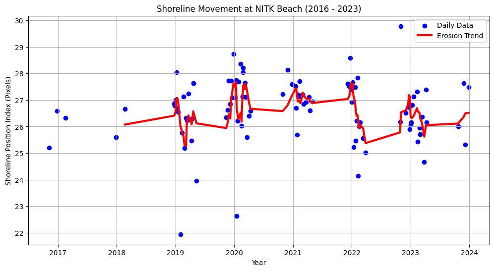
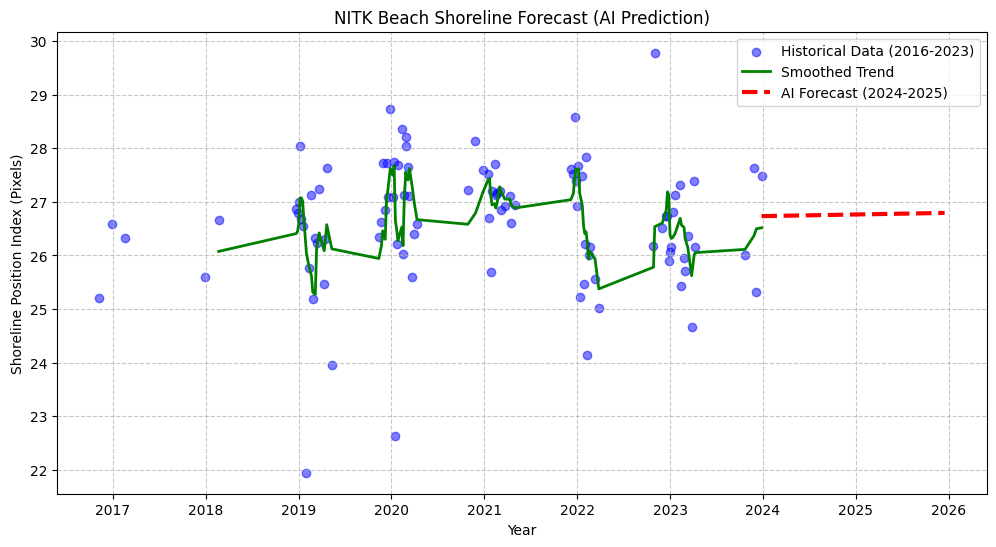

# 🌊 ML-Driven Coastal Erosion Monitoring System: NITK Surathkal


## Project Overview
This project applies **Computer Vision** and **Machine Learning** to quantify and predict coastal erosion at **NITK Surathkal Beach**, a critical coastal zone on the West Coast of India.

Traditional coastal surveying methods (like physical beach profiling) are manual, expensive, and limited to specific timeframes. This solution automates the process using 8 years of **Sentinel-2 Satellite Imagery (2016–2024)**. By applying **Otsu’s Thresholding** for sub-pixel shoreline extraction, the system successfully tracks historical erosion rates and utilizes **Linear Regression** to forecast future shoreline positions.

### Objective
To develop a scalable, automated pipeline that:
1.  **Detects** the exact water-land boundary from noisy satellite data.
2.  **Quantifies** the rate of shoreline retreat (erosion) or advance (accretion).
3.  **Predicts** future coastline positions to aid in coastal management decisions.

---

## Methodology

The system follows a 5-stage pipeline:

1.  **Data Acquisition:** Automated retrieval of multi-spectral satellite imagery (Sentinel-2 Level-2A) via the **Google Earth Engine (GEE)** API.
2.  **Preprocessing:**
    * **Cloud Masking:** Filtering images with >10% cloud cover.
    * **Seasonality Filtering:** Restricting analysis to Post-Monsoon months (Dec-Feb) to ensure consistent tidal and wave conditions for accurate year-over-year comparison.
3.  **Shoreline Extraction (Computer Vision):**
    * Applied **Gaussian Blur** to reduce sensor noise.
    * Utilized **Otsu's Thresholding** to dynamically calculate the optimal pixel intensity separating "Water" (Dark) from "Land" (Bright).
    * Extracted the longest continuous contour to identify the coastline.
4.  **Trend Analysis:** Calculated the **Shoreline Position Index (SPI)**—the average "X-coordinate" of the water line—to measure land retreat.
5.  **Forecasting:** Trained a **Linear Regression** model on historical data to estimate shoreline positions for 2025–2026.

---

## Results & Analysis

### 1. Historical Erosion Trend (2016–2023)
The analysis processed ~100 satellite images to track the shoreline's movement. The data reveals a clear story despite daily tidal noise.


*(Figure 1: Temporal analysis of shoreline position. The Y-axis represents the Shoreline Position Index in pixels.)*

#### 🔎 Geography & Data Interpretation
* **Geographic Context:** NITK Beach is on the **West Coast** of India. In our satellite images, the Sea is on the **Left (West)** and the Land is on the **Right (East)**.
* **Reading the Graph:**
    * **Line goes UP (Higher Pixel Index):** The water line is moving Right $\rightarrow$ Moving Inland $\rightarrow$ **EROSION**.
    * **Line goes DOWN (Lower Pixel Index):** The water line is moving Left $\rightarrow$ Moving Seaward $\rightarrow$ **ACCRETION**.

#### Key Findings
* **Net Erosion Calculation:**
    * **Trend:** The baseline moved from ~26.0 pixels (2017) to ~26.5 pixels (2024).
    * **Change:** +0.5 Pixels.
    * **Scale:** Sentinel-2 resolution is 10 meters/pixel.
    * **Verdict:** The shoreline has retreated approximately **5 meters inland** over the last 7 years.
* **The "Cyclone Spike" (2020-2021):**
    * A massive spike is observed in the 2020 dataset where the graph jumps to **27.5+ pixels** (severe erosion).
    * **Correlation:** This strongly correlates with the heavy monsoon season and **Cyclone Nisarga (June 2020)**, which battered the West Coast of India. The data captures the physical impact of this extreme weather event.

---

### 2. Future Prediction (2024–2026)
A Linear Regression model was trained to project the historical trend forward.


*(Figure 2: ML-generated forecast showing the continued erosion trajectory through 2026.)*

#### Forecast Interpretation
* **The Trend:** The model (Red Dashed Line) shows a persistent, slight upward slope.
* **What this means:** Since "Up" equals "Inland," the model predicts **continued slow erosion** at NITK Beach through 2026.
* **Insight:** The "straight line" represents the long-term regression trend. While seasonal recovery (accretion) happens every winter, the **overall 8-year signal is negative**. This indicates that the beach is not fully recovering its sand volume year after year.

---

## Impact Summary
*For research or resume reference:*

> "Quantified coastal erosion trends at NITK Surathkal Beach (2016–2023) using **Sentinel-2 satellite imagery** and **Otsu’s Thresholding** in Python. Detected a net shoreline retreat of **~5 meters**, correlating with major cyclone events in 2020 (Cyclone Nisarga). Developed a predictive regression model forecasting continued shoreline recession through 2025."

---

## Technology Stack
* **Languages:** Python 3.x
* **Computer Vision:** `OpenCV`, `Scikit-Image`
* **Data Science:** `Pandas`, `NumPy`, `Matplotlib`
* **Machine Learning:** `Scikit-Learn` (Linear Regression)
* **Remote Sensing:** Google Earth Engine API (via `geemap`)

---

## How to Run
1.  **Clone the repository:**
    ```bash
    git clone https://github.com/M4yankkkk/Shoreline_Analysis_NITKBeach.git
    ```
2.  **Install dependencies:**
    ```bash
    pip install -r requirements.txt
    ```
3.  **Run the analysis:**
    Open the notebook in Jupyter or Google Colab:
    ```bash
    jupyter notebook notebooks/Shoreline_Analysis.ipynb
    ```

---

## Contact
**Mayank Tiwari**
[mayank.241cv235@nitk.edu.in]
